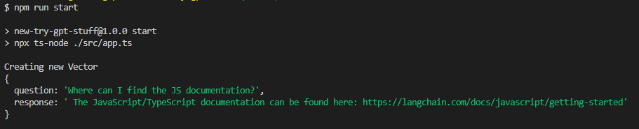

# Easy LangChain TS demo
## Sources
- https://www.youtube.com/watch?v=2xxziIWmaSA
- https://github.com/gkamradt/langchain-tutorials/blob/main/LangChain%20Cookbook.ipynb
- https://www.youtube.com/watch?v=Wxx1KUWJFv4
- https://github.com/developersdigest/Get_Started_with_LangChain_in_Nodejs

### Get started
1. Create .env with your OpenAI API-Key (see `.env.example`)
2. Replace the `LangChain Cookbook.pdf` file in the `docs` folder with your pdfs
3. Delete the `my_new_store.index` folder (Contains the index file of current docs)
4. Run `npm i`
5. Run `npm run start`\
   Output:
